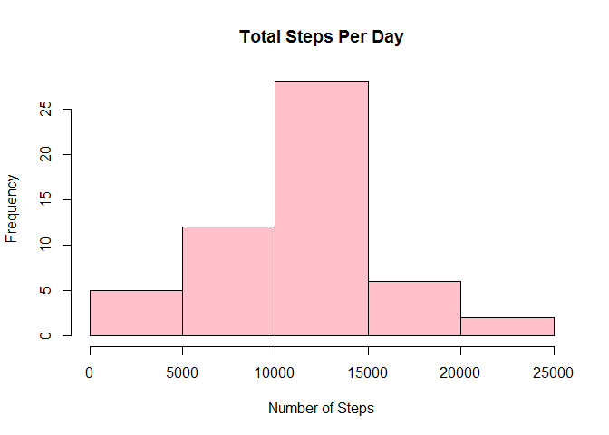
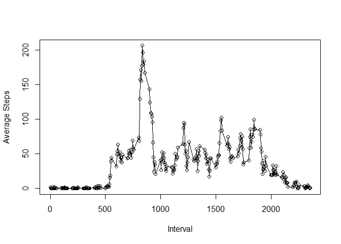
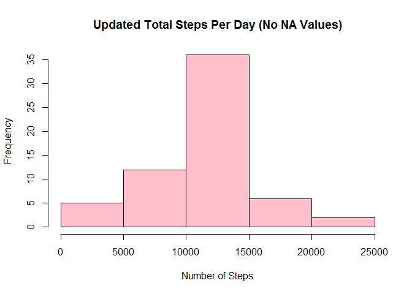
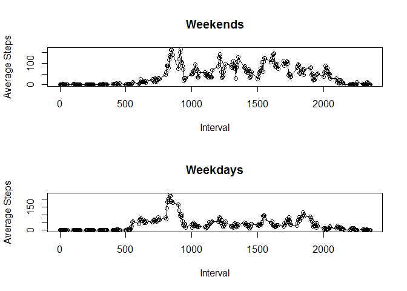

<font size = +3><b>
Project 1
<br>
Reproducible Research
</b></font><br>

## Loading and preprocessing the data


```r
library(sqldf)
```

```
## Loading required package: gsubfn
## Loading required package: proto
## Loading required package: RSQLite
## Loading required package: DBI
```

```r
#Load in the data
activity_data <- read.csv("activity.csv")
```


## What is mean total number of steps taken per day?


```r
#This data frame does not include NA values in the steps. Sum the steps for each date.
total_steps <- sqldf("Select activity_data.date, SUM(activity_data.steps) as total_steps_per_day from activity_data where activity_data.steps <> 'NA' group by activity_data.date")
```

```
## Loading required package: tcltk
```

```r
#Print the average and median steps per day.
average_total_steps_per_day = mean(total_steps$total_steps_per_day)
median_total_steps_per_day = median(total_steps$total_steps_per_day)
print(c("Mean number of total steps per day:", average_total_steps_per_day))
```

```
## [1] "Mean number of total steps per day:"
## [2] "10766.1886792453"
```

```r
print(c("Median number of total steps per day:" , median_total_steps_per_day))
```

```
## [1] "Median number of total steps per day:"
## [2] "10765"
```

```r
#Create a histogram
hist(total_steps$total_steps_per_day, main = "Total Steps Per Day", xlab = "Number of Steps", ylab = "Frequency", col = "pink")
```

 


## What is the average daily activity pattern?


```r
#Retrieve the average steps per interval for all days.  Do not include the NA values.
avg_steps_per_interval <- sqldf("Select activity_data.interval, AVG(activity_data.steps) as average_steps_per_interval from activity_data where activity_data.steps <> 'NA' group by activity_data.interval")
x <- avg_steps_per_interval$interval
y <- avg_steps_per_interval$average_steps_per_interval

#Plot the data
plot.ts(x, y, ylab = "Average Steps", xlab = "Interval" , xy.labels = FALSE, xy.lines = TRUE)
```

 

```r
#Retrieve the interval with the largest average number of steps
avg_steps_per_interval <- sqldf("Select activity_data.interval, AVG(activity_data.steps) as average_steps_per_interval from activity_data where activity_data.steps <> 'NA' group by activity_data.interval order by average_steps_per_interval desc")
max_interval = head(avg_steps_per_interval, 1)
print(c("The interval with the largest average number of steps:", max_interval))
```

```
## [[1]]
## [1] "The interval with the largest average number of steps:"
## 
## $interval
## [1] 835
## 
## $average_steps_per_interval
## [1] 206.1698
```


## Imputing missing values


```r
#Retrieve the number of NA values for steps
number_NA <- sqldf("Select activity_data.date from activity_data where activity_data.steps is NULL")
print(c("The number of rows with missing steps (NA for steps) is: ", nrow(number_NA)))
```

```
## [1] "The number of rows with missing steps (NA for steps) is: "
## [2] "2304"
```


<br><br>

<font size = +3 color = red><b>
I used the average total steps per interval to fill in the missing NA values for steps for that interval.
</b></font>

<br><br>


```r
#Retrieve the average for each interval. Do not include NA values
avg_steps_per_interval <- sqldf("Select activity_data.interval, AVG(activity_data.steps) as average_steps_per_interval from activity_data where activity_data.steps <> 'NA' group by activity_data.interval")

#Retrieve the number of rows
number_rows <- nrow(avg_steps_per_interval)

#Create a new data frame
updated_activity_data <- sqldf("Select * from activity_data order by activity_data.date")

#Set i to 1
i <- 1

#For all rows, if there is a NA for the steps then replace the NA with the average for that interval.
while (i <= number_rows) 
{ #Retrieve the interval number 
  current_interval <- avg_steps_per_interval[i,1]
  
  #Update the record in the data frame
  updated_activity_data[(is.na(updated_activity_data$steps)) & (updated_activity_data$interval == current_interval), 1] <- avg_steps_per_interval[i, 2]
  
  i <- i + 1
  
}


#write.csv(updated_activity_data, "updated.csv")

updated_total_steps <- sqldf("Select updated_activity_data.date, SUM(updated_activity_data.steps) as total_steps_per_day from updated_activity_data group by updated_activity_data.date")


#Print the average and median steps per day.
updated_average_total_steps_per_day = mean(updated_total_steps$total_steps_per_day)
updated_median_total_steps_per_day = median(updated_total_steps$total_steps_per_day)
print(c("Mean number of total steps per day for the updated data (No NA values):", updated_average_total_steps_per_day))
```

```
## [1] "Mean number of total steps per day for the updated data (No NA values):"
## [2] "10766.1886792453"
```

```r
print(c("Median number of total steps per day for the updated data (No NA values):" , updated_median_total_steps_per_day))
```

```
## [1] "Median number of total steps per day for the updated data (No NA values):"
## [2] "10766.1886792453"
```

```r
#Create a histogram of the updated data
hist(updated_total_steps$total_steps_per_day, main = "Updated Total Steps Per Day (No NA Values)", xlab = "Number of Steps", ylab = "Frequency", col = "pink")
```

 


## Are there differences in activity patterns between weekdays and weekends?


```r
#Create another column in the data set:
updated_activity_data["Type_of_Day"] <- factor(NA, levels = c("Weekend", "Weekday") )
number_rows <-nrow(updated_activity_data)
i <- 1

#For all rows, determine if the date is a weekday or weekend day
while (i <= number_rows) 
{
  if ((weekdays(as.Date(updated_activity_data[i, 2])) == "Saturday"))
    
  {
    updated_activity_data[i, 4] <- "Weekend"
    
  }
  else if ((weekdays(as.Date(updated_activity_data[i, 2])) == "Sunday"))
  {
    updated_activity_data[i, 4] <- "Weekend"
    
  }
  else
  {
    updated_activity_data[i, 4] <- "Weekday"
    
  }
  
  
   i <- i + 1
  
}


#Create 2 plots
par(mfrow = c(2, 1))

#Plot the weekends
updated_avg_steps_per_interval <- sqldf("Select updated_activity_data.interval, AVG(updated_activity_data.steps) as average_steps_per_interval from updated_activity_data where updated_activity_data.Type_of_Day = 'Weekend' group by updated_activity_data.interval")
x1 <- updated_avg_steps_per_interval$interval
y1 <- updated_avg_steps_per_interval$average_steps_per_interval
plot.ts(x1, y1, ylab = "Average Steps", xlab = "Interval", xy.labels = FALSE, xy.lines = TRUE, main = "Weekends")


#Plot the weekdays
updated_avg_steps_per_interval <- sqldf("Select updated_activity_data.interval, AVG(updated_activity_data.steps) as average_steps_per_interval from updated_activity_data where updated_activity_data.Type_of_Day = 'Weekday' group by updated_activity_data.interval")
x2 <- updated_avg_steps_per_interval$interval
y2 <- updated_avg_steps_per_interval$average_steps_per_interval
plot.ts(x2, y2, ylab = "Average Steps", xlab = "Interval", xy.labels = FALSE, xy.lines = TRUE, main = "Weekdays")
```

 

